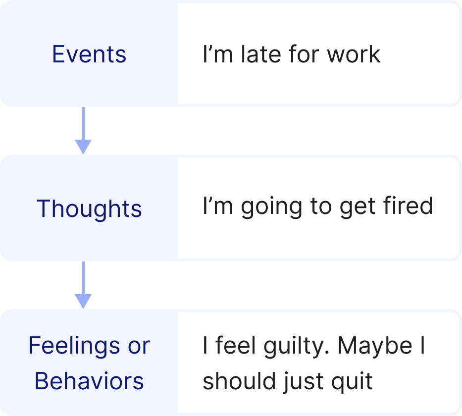
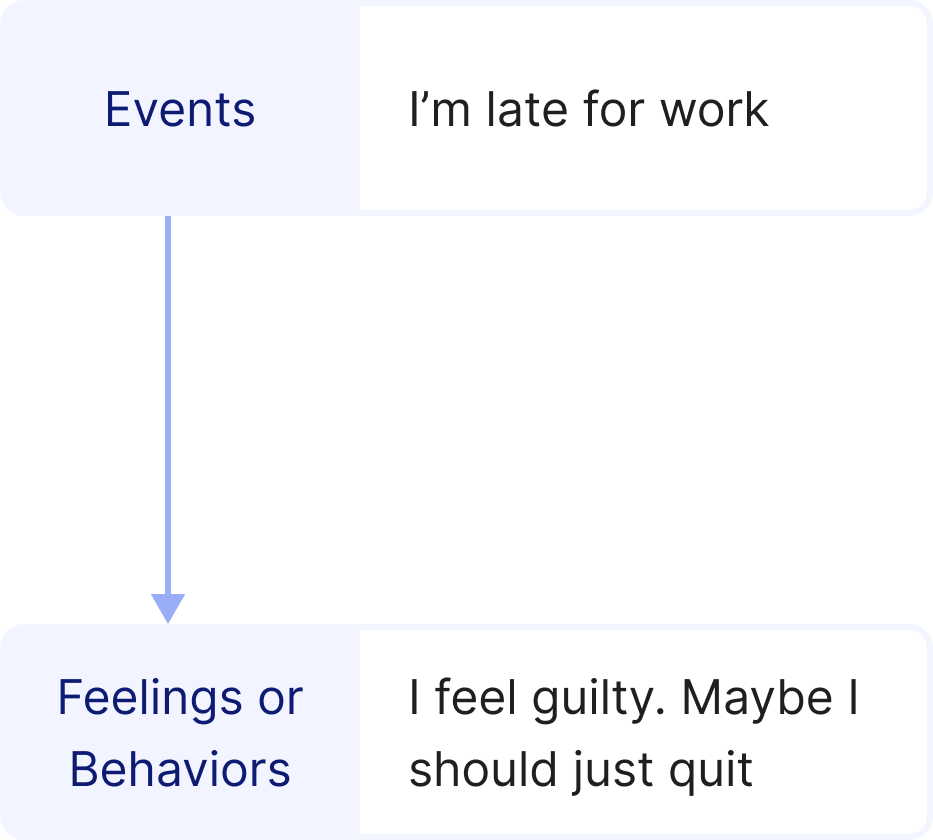

# Lesson - Awareness of Negative Thinking

## Screen 1
Our thoughts can have a big impact on our feelings and behaviors. Positive and negative thinking will often lead to certain responses. This session will focus on how to become aware of negative thinking.

## Screen 2
Negative thinking can lead to negative emotions, such as low self-esteem, anger, depression, stress, anxiety, or boredom. These emotions can lead to cravings or relapse. You must therefore learn to recognize your negative thoughts and moods. There are signals that can help you identify and stop or change negative thinking.

## Screen 3
Changing your thinking might not make you feel better instantly. It takes time and practice before you learn to catch yourself thinking negatively and develop positive thinking to change your moods and feelings.

## Screen 4
The following model shows the relationship between events, thoughts about those events and feelings that stem from those thoughts:

You can learn to *recognize* and then *control* or change your feelings by managing your negative thoughts.

## Screen 5
Sometimes we move right into the negative behavior and do not think about the situation.

For example, let's say the event is "I am late for work". The thought in response to the event is "I'm going to get fired". The reaction to the thought is "I feel guilty. Maybe I should just quit".

Making positive self-statements before the feeling or behavior can help change a negative outcome to a positive outcome. In the example of being late for work, positive self-statements may include, "I am not usually late. I can talk to my supervisor and explain what happened. I am a good worker."

## Screen 6
Typically, we don't just automatically get upset, depressed, or tense. What we think or say to ourselves ("self-talk") about events causes us to get upset. Self-talk is a type of thinking that comes in between events and feelings/behaviors. This model helps us become aware of our negative thoughts.

If we can catch our negative thoughts, we can change them into positive thoughts. This will make us feel better about ourselves, and be less moody, upset, or tense. Avoiding these feelings will decrease cravings to use drugs as a coping response to difficult feelings.

## Screen 7
We must catch our negative self-talk, even though it is hard to do and seems to happen "in a flash". We can learn how to slow down our actions and become more aware of our negative self-talk by stating our thoughts out loud instead of keeping them silently in our heads.

Sometimes we have to work backwards from our feelings or cravings in order to figure out what thoughts and situations set us off in the first place. Once we are able to catch our negative thoughts, we can learn to change them.

## Screen 8
The main steps to changing your negative thinking are the following:
**a. *Catch yourself thinking negatively***. You must learn what kinds of negative thinking habits you have learned over the years and have come to use automatically.
**b. *Stop the negative thinking pattern and switch to a more reasonable set of thoughts***. Replace the negative thoughts with positive or neutral thoughts.

## Screen 9
There are several categories of self-talk.
a. Perfectionism: "I must do everything right" OR "Other people should always be dependable."
b. Catastrophizing: "Work is not going well. We probably will get shut down."
c. Overgeneralizing: "I got the question wrong on the test. I probably will flunk out of school."
d. Expecting the worst: "I know that I messed up at work. My boss is going to yell at me."
e. Self-putdowns: "I'm really not a good person because I used drugs."
f. Black-and-white thinking: "I'm doomed for failure for the rest of my life after getting fired from my job."

## Screen 10
We must learn to identify unrealistic expectations. We should avoid words such as "should","never","always", and negative self-talk (perfectionism, catastrophizing, overgeneralization, expecting the worst, self-putdowns, and black-and-white thinking).

## Screen 11
You can download and print the "Thinking and Feeling" worksheet. You can use this worksheet to better recognize and learn how to change negative thoughts you may have.

[ModuleWorksheetLink](ThinkingandFeelingWorksheet.pdf)

