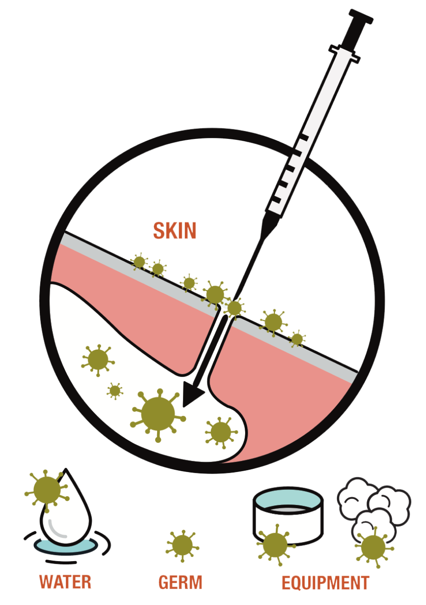
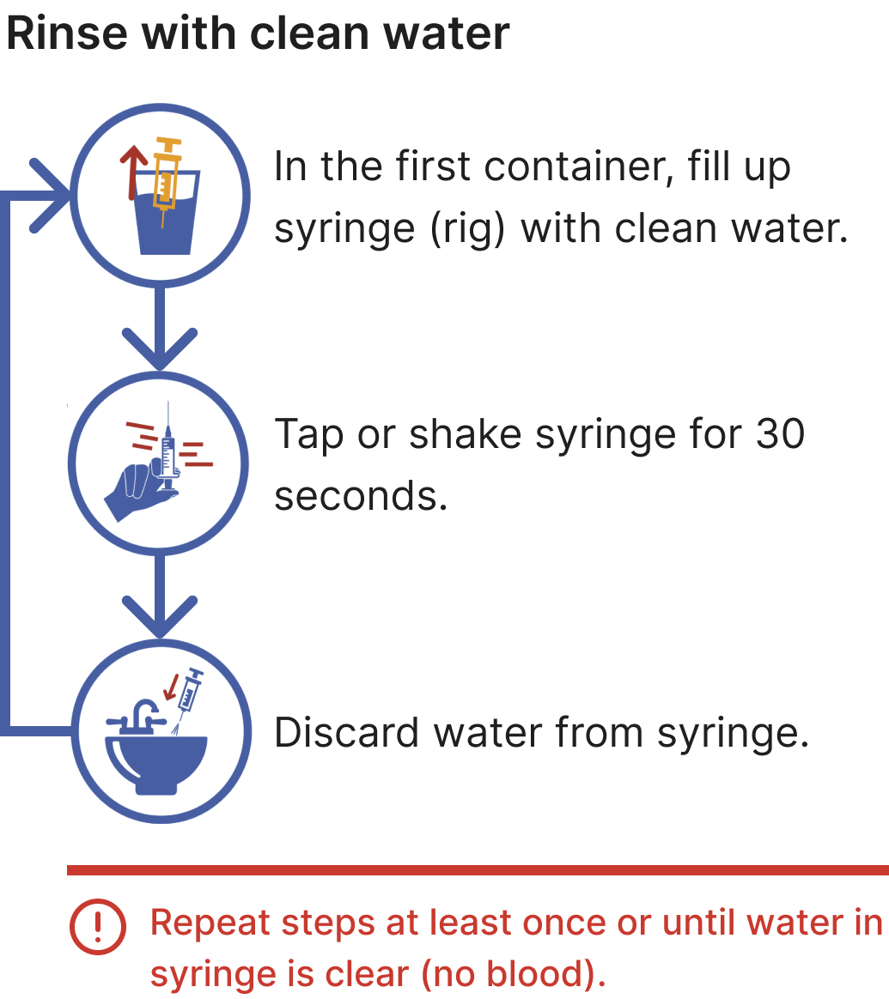
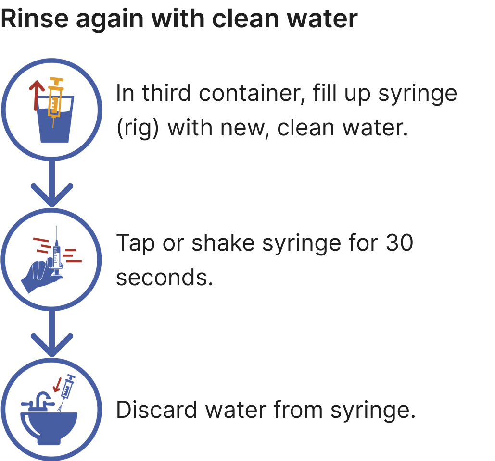
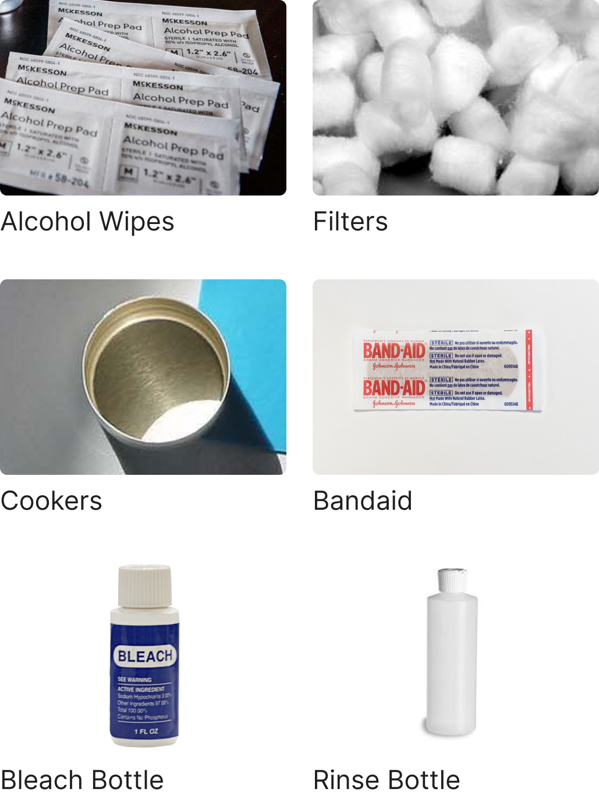

# Lesson - Drug Use, HIV, and Hepatitis

## Screen 1
Drug use is risky for many reasons, but one of the potential risks that a person takes when using drugs is transmitting a potentially life-threatening disease like HIV or hepatitis B or C. Drug use in and of itself does not directly put a person at risk for HIV and hepatitis, but if a person shares any of the equipment used to do drugs, or if a person takes sexual risks while using, they could be at high risk for infection with these diseases.

## Screen 2
HIV and hepatitis B and C can all be transmitted when blood containing those viruses gets into a person’s bloodstream. There are several ways that this can happen while sharing drug equipment or works.

## Screen 3
If you use a needle to inject drugs and you share the needles and syringes you use with others, you are at risk for transmitting HIV and hepatitis B and C. The greatest risk comes from injecting with shared works into a vein, but there is also risk from skin-popping (injecting just under the skin) or muscle-popping (injecting into muscle).

## Screen 4
It does not matter what kind of drug you are injecting. You could be using heroin, cocaine, steroids, even insulin for diabetes. If you are sharing needles and syringes to inject any substance you are at risk for HIV and hepatitis transmission. There is also risk from sharing needles for tattooing and body piercing.

## Screen 5
Blood can remain inside needles and/or syringes from one person to the next, meaning that you could be injecting someone else’s blood into your bloodstream if you share this equipment. This is one of the easiest ways to transmit HIV and hepatitis.

## Screen 6
In addition to the risk from sharing needles and syringes, there is also risk if you share cookers or spoons, water, and filters or cottons. Blood that may contain HIV and hepatitis can remain on this equipment too and can be spread from person to person.

## Screen 7
If you snort or smoke a drug and you share straws, dollar bills, and/or pipes, you are also at risk for transmitting HIV and hepatitis. Snorting and smoking can cause the nose, lips and mouth to bleed. If you are sharing equipment, blood that may contain HIV and hepatitis can be passed from person to person, entering the bloodstream through broken skin in the nose, lips or mouth.

## Screen 8
The best way to prevent infection with HIV and hepatitis through shared drug equipment is to stop using the drug. If you choose to continue to use the drug, use only your own works or equipment and do not share with other people.

## Screen 9
If you do share needles and syringes, make sure they are cleaned thoroughly with cold water and bleach before and after each use to reduce the risk of transmitting HIV and hepatitis. 

To clean a syringe correctly, you must do all nine steps shown on the following screens.

These instructions are based on CDC guidelines (July 2019).

## Screen 10
-If possible, **always use a new, sterile syringe** and never share any injection equipment
-A disinfected syringe is not as good as new, sterile syringe, but it can greatly reduce your risk for HIV and viral hepatitis
-Wash your hands before cleaning your syringes
-You will need three clean containers, clean water, and bleach.

## Screen 11

## Screen 12

## Screen 13

## Screen 14
Cookers or spoons can also be cleaned with bleach if they are going to be shared. Remember to always rinse with cold water after bleaching any drug equipment.

## Screen 15
Many youth organizations, HIV prevention programs and needle exchange programs have bleach kits available. A bleach kit (see picture below) usually contains a small bottle of bleach, clean cookers and cottons, alcohol pads for cleaning the skin before injecting, condoms and instructions for bleaching needles and syringes. It is important to note that cleaning the skin with alcohol before injecting will reduce the risk of getting bacteria into your body, but it will not reduce the risk of getting HIV or hepatitis.

## Screen 16
In addition to the risk from sharing equipment, drug use can also lead to risk through sexual activity. Many drugs can affect your mind by reducing your judgment and ability to make good decisions and lowering your inhibitions, making it more likely that you will do things that you would not choose to do if you did not use the drug.

## Screen 17
While using drugs, you may end up having sex when you didn’t plan to or having sex without a condom or other barrier to protect against HIV, hepatitis and sexually transmitted infections (STIs). Your coordination may also be affected, making it difficult to use a condom or other barrier correctly even if you choose to use one.

## Screen 18
In addition, many people who use drugs become addicted and go to great lengths trying to get the drug. Some people resort to exchanging sex for money or drugs. It may be difficult to insist on condom use or protected sex if you are trying to get drugs or money from the person you are having sex with. This can put you at high risk for HIV and other STIs.

## Screen 19
Finally, the use of certain drugs can suppress or weaken your immune system, making it harder for your body to fight off infection and viruses. When your immune system is suppressed, it can make it easier to get HIV, hepatitis and STIs. If you have HIV, using drugs can weaken your immune system even further, putting you at risk for developing AIDS.

