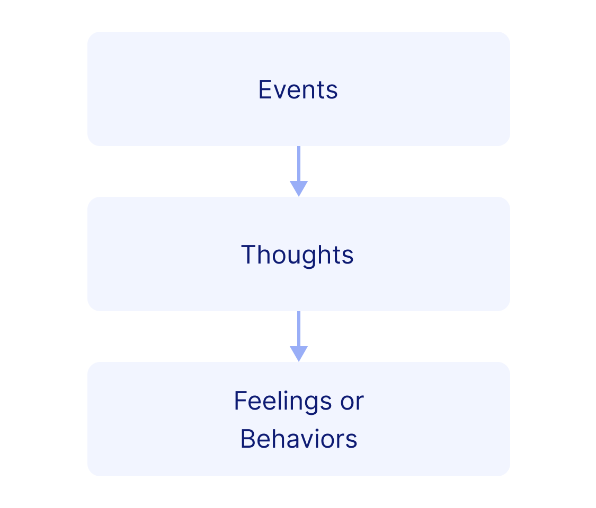

# Lesson - Managing Negative Thinking

## Screen 1
There are several ways to stop negative thoughts and replace them with more positive thoughts. With repetition and practice, this will gradually help you to feel better about yourself.

## Screen 2
As you have already learned, the following model shows the relationship between thoughts and feelings:

This model shows that you can learn to recognize and then control your feelings by changing your thoughts. Remember, you control the messages you give to yourself and how you react to events. Allowing others to take control of your behavior is unhealthy and can be self-destructive.

## Screen 3
Consider the following example:
**EVENT**: It’s your first week of school, and you overslept and missed your class.

**NEGATIVE THOUGHTS**: "I can't do anything right."
"I am a careless person."
"I am a bad student."

**NEGATIVE FEELINGS**:
nervous, angry, guilty, want to use drugs to feel relaxed

## Screen 4
Consider another view of the situation:

**EVENT**: It’s your first week of school, and you overslept and missed class.

**POSITIVE ALTERNATIVE THOUGHTS**:
"It’s my first class of the year."
"I won’t do this again. I need to buy an alarm clock that works."
"I will speak with my professor to get the work that I missed."
"I will work hard to show that I’m a good student."

**POSITIVE FEELINGS**:
confident, able to fix mistakes, responsible, no urge to use drugs

## Screen 5
There are three steps in stopping the negative thinking cycle:

1. Become aware of negative self-talk.
2. Stop the thinking once you become aware.
3. Use positive self-statements instead of negative self-talk.

Stop the cycle of negative thinking as soon as possible, before you get too upset.

## Screen 6
Presented below is a list of a few basic types of positive self-statements that might be helpful. These statements can improve your ability to think positively. Using these positive statements in place of negative thoughts will take time and practice.

## Screen 7
Positive self-statements may include "What is the last good deed that I have done?" or "What do I like about myself?" Instead of focusing on something you have done wrong, ask yourself "What have I done well lately? How can I learn to do this better?"

## Screen 8
Recognize unrealistic expectations and extreme thinking. Avoid self-statements that include words like:
-should, must, ought to, have to
-awful, terrible, disastrous
-always, never, forever

## Screen 9
Learn to avoid the different types of negative thinking. Find new ways of handling these thoughts.

## Screen 10
*Perfectionism*: Do not try to be perfect. Everyone makes mistakes. Perfection is not within reach for anyone. Mistakes and errors are a part of human nature.

## Screen 11
*Catastrophizing*: Realize that the fear of a bad event happening is usually worse than the actual event. Try to improve your outlook. Do not dwell on the bad things that may or may not happen.

## Screen 12
*Overgeneralizing*: Remind yourself that one mistake or one bad day does not make you a failure. Doing poorly on a test does not mean that you will fail the class.

## Screen 13
*Expecting the Worst*: Negative and positive thinking can be a self-fulfilling prophecy. Try to focus on the positive. Be open and optimistic about good outcomes.

## Screen 14
*Self-Put-downs*: Avoid self-blame. Making one mistake does not make you a bad person. Again, everyone makes mistakes or bad choices from time to time.

## Screen 15
*Black-and-White Thinking*: Thinking in terms of something being "all good" or "all bad" can lead to trouble. In reality there are good times and bad times. One hard day does not mean you will have hardship for the rest of your life.

## Screen 16
Focus on what needs to be done. Make a plan that will help you succeed. Don’t be afraid to ask for help. Remember how you have been successful in the past.

## Screen 17
Give yourself positive self-statements and encouragement when you have handled a difficult situation well. Think back to this accomplishment when you face your next difficult situation.

## Screen 18
You can pick up a copy of a reminder sheet at this time entitled, "Reminder Sheet – Positive Thinking". This sheet lists positive statements you can use to replace negative thinking. You should also pick up a copy of the "Positive Thinking Worksheet". Please fill out this worksheet to help you practice positive thinking.

[ModuleWorksheetLink](PositiveThinkingReminderSheet.pdf)

