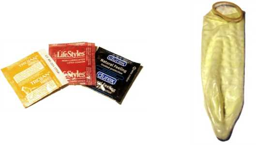
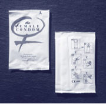
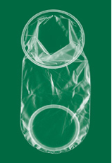

# Lesson - Sexual Transmission of HIV and STIs

## Screen 1
There are specific sexual activities that are risky for HIV and sexually transmitted infections (STIs). Remember that you cannot tell by looking at someone whether or not they are infected with HIV or another STI. HIV and many STIs can be present without any signs or symptoms.

## Screen 2
Any activity that involves the fluids that transmit HIV (blood, semen, vaginal fluid and breast milk) may pose some risk for HIV. In order for HIV infection to take place, these fluids need a way to get into your bloodstream.

## Screen 3
The fragile skin of the vagina, anus and mouth can be a way for viruses like HIV to get into your body. Because of this, vaginal, anal and oral sex with men or women can all be risky for HIV as well as many other STIs.

## Screen 4
Many STIs can also be transmitted through skin contact, such as herpes and HPV, the virus that causes genital warts. This can happen even when condoms are used, because the infected skin may be outside of the area covered by the condom.

## Screen 5
There are things you can do to reduce your risk of getting HIV and other STIs. The best way to make sure you do not get HIV or another STI is to not have sex. There are also things you can do if you decide to have sex that can make sex safer.

## Screen 6
It can be helpful to decide for yourself ahead of time the choices that you want to make about sex and your health. Some people choose not to have sex until they are in a committed relationship. Some people choose to only have sex after both partners have been tested for HIV and other STIs. And others only have sex with a condom or other form of protection against infection.

## Screen 7
Deciding ahead of time what sexual activity you are comfortable with and sticking to your decision can help you to have peace of mind and even enjoy a relationship or sex more because you are less worried about getting an infection.

## Screen 8
There are lots of ways to be affectionate with a partner that will not put you at risk for HIV and other STIs. Some examples include cuddling, holding hands, massaging each other, touching your own genitals (masturbation) and hand-to-genital touching (hand job) or mutual masturbation provided neither partner has a break in the skin on their hands.

## Screen 9
If you decide to have vaginal or anal sex, latex condoms used correctly every time can greatly reduce the risk of HIV and some of the other STIs. Using a water-based lubricant (such as K-Y® jelly or Astroglide®) with a latex condom can help reduce the risk of tearing skin or the condom breaking, and can make sex more enjoyable. Below are some pictures of different kinds of condoms.

## Screen 10
There is also a condom available that can be worn in the vagina called the female condom. The female condom is made out of polyurethane, and is inserted into the vagina to form a pouch which prevents semen or cum from coming in contact with the skin of the vagina. Below are some pictures of the female condom.

## Screen 11
HIV, herpes, and gonorrhea can all be spread through oral sex. The risk is greater for the person doing the oral sex on another person than for the person receiving the oral sex. If you decide to have oral sex, there are several options for reducing your risk.

## Screen 12
For oral sex on a man (also called fellatio or giving a blow job), putting a latex condom on the penis can greatly reduce the risk of getting HIV or an STI. There is also less risk for HIV if your mouth and gums are healthy (no open sores or breaks in the skin) and if the man does not ejaculate or cum in your mouth.

## Screen 13
For oral sex on a woman (also called cunnilingus), or for mouth-to-anus contact, plastic wrap, a latex condom cut up the side and unrolled, or a latex “dam” can be used to reduce risk by preventing vaginal fluid or feces from getting in your mouth. Menstrual blood can transmit HIV as well, so avoiding oral sex on a woman during her period can also reduce risk.

## Screen 14
Latex gloves can be used for inserting fingers into the vagina or anus to reduce risk. If you have had fingers in someone’s anus, it is important not to put them in someone’s vagina or mouth without washing with soap and water first to reduce risk of transmitting hepatitis A or causing a vaginal infection.

## Screen 15
It is your decision how much risk you are willing to take. Talking with your partner ahead of time about what you are comfortable with can make it easier to stick to your decisions in the heat of the moment.

