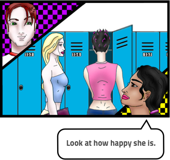

# Lesson - Social and Media Influences on Drug Use and Sexual Activity

## Screen 1
Youth receive information about drug use and sex from many different sources including parents, school, friends, TV, movies, web sites, health centers and others.  Each of these sources conveys information differently, and many of these sources often convey different information.  It can sometimes be difficult to sort out what is true or reality and what is fictional or fantasy.

## Screen 2
All of these sources can be helpful, but it is important to understand that each source of information is presented from a certain perspective or point of view and has a certain goal.

## Screen 3
The key to sorting out what information to rely on is to gather it from several different sources, and to be able to think critically about what you are hearing, seeing or reading.  Thinking critically means looking closely beneath the surface to understand the deeper meanings or messages.

## Screen 4
The media is a large source of information for many young people and adults.  Media refers to the specific way that something is communicated to large numbers of people.  Examples of media are magazines, TV, newspapers, music, movies, or web pages.

## Screen 5
Each piece of media is made for a certain reason by a person or group of people that have certain opinions.  Below are several questions that you can consider to help you to think critically and analyze the messages that the media is conveying.

## Screen 6
- Who paid for the media and why?
- Who is the audience being targeted by the media message?
- What messages and values are being expressed by the media message?
- What kind of lifestyle is presented in the message, and is this lifestyle glamorized? If so, how?
- What is the text of the media message (what is it saying directly)?
- What is the subtext (what is it saying indirectly)?
- What techniques of persuasion are used?
- In what ways is this a healthy and/or unhealthy example of the media?

## Screen 7
There is no one correct answer to these questions.  Different people will find their own meanings from media and from their analysis of it.  Next time you watch your favorite TV show, try to answer these questions as you watch.  You’ll find that you will become much more aware of what is going on behind the plot or storyline.

## Screen 8
Check out the following comic strip.  In the comic strip two friends, Joey and Kim, are watching their favorite TV show Dillon’s Brook.

## Screen 9

## Screen 10

## Screen 11

## Screen 12

## Screen 13

## Screen 14

## Screen 15

## Screen 16

## Screen 17

## Screen 18

## Screen 19

## Screen 20
A recent study by the Kaiser Family Foundation found that 83% of TV shows most popular with teens had some sort of sexual content.  The study also found that of these shows, only 45% included references to safer sex.  In the comic strip, Kim was swept up in the romance of the story, while Joey was thinking critically about what he was seeing and identifying the risks that were being taken.  The TV show in this comic strip did address the risks of unprotected sex, but many do not.

## Screen 21
When watching shows or movies with sexual content, think about whether the show is portraying the realities of sex, such as the consequences of unprotected sex, or whether the characters are concerned about pregnancy or sexually transmitted infections.

## Screen 22
Sex and drug and alcohol use are everywhere in the media.  Sometimes media messages about sex and drug use can be really valuable sources of information, and sometimes they are very unrealistic or glamorize sex and drug use without showing some of the negative consequences.  Use your critical thinking skills to evaluate the messages you see in the media about sex and drug and alcohol use.

