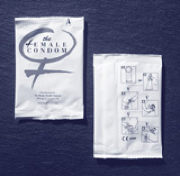
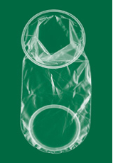

# Lesson - The Female Condom

## Screen 1
The female condom is a condom that can be worn by women who want to reduce their risk for HIV and other sexually transmitted infections (STIs). The female condom is made of a type of plastic called polyurethane, and works by loosely lining the vagina.

The package that a female condom comes in looks like this:

## Screen 2
Studies have shown that the female condom is effective in reducing risk for STIs and HIV if used correctly and consistently. Some people also use it for anal sex (inserted inside the anus) but is has not yet been approved or recommended for anal use.

## Screen 3
Some advantages of the female condom are that it is something that women can wear to reduce their risk, it can be inserted several hours before sexual activity, and because it is made out of polyurethane, it can be used by people who are allergic to latex.

## Screen 4
The female condom is about 6.5 inches long, and has an inner flexible ring at the closed end to hold it in place in the vagina, and another ring at the open end that stays outside the vagina. The female condom comes pre-lubricated, and more lubricant can be added. Because the female condom is not made of latex, water or oil-based lubricant can be used.

Out of the package, it looks like this:

## Screen 5
Just like the male condom, the female condom has an expiration date that you should check before using it. Because it is made out of plastic, the female condom does not have any special requirements as to where to store or keep it prior to use. The following pictures illustrate the steps to using a female condom correctly.

## Screen 6
Open the package carefully; tear at the notch on the top right of the package. Do not use scissors or a knife to open.

## Screen 7
The outer ring covers the area around the opening of the vagina. The inner ring is used for insertion and to help hold the sheath in place during sexual activity.

## Screen 8
While holding the sheath at the closed end, grasp the flexible inner ring and squeeze it with the thumb and second or middle finger so it becomes long and narrow.

## Screen 9
Choose a position that is comfortable for insertion- squat, raise one leg, sit or lie down.

## Screen 10
Gently insert the inner ring into the vagina. Feel the inner ring go up and move into place.

## Screen 11
Place the index finger on the inside of the condom and push the inner ring up as far as it will go. Be sure the sheath is not twisted. The outer ring should remain on the outside of the vagina.

## Screen 12
The female condom is now in place and ready for use with your partner.

## Screen 13
When you are ready, gently guide your partner’s penis into the sheath’s opening with your hand to make sure that it enters properly. Be sure that the penis is not entering on the side, between the sheath and the vaginal wall.

## Screen 14
To remove the condom, twist the outer ring and gently pull the condom out.

## Screen 15
Wrap the condom in the package or in tissue and throw it in the garbage. Do not put it into the toilet.

## Screen 16
It may take some practice to get used to using the female condom. It is recommended that women practice putting it in and removing it several times before using it for sexual activity so that they feel confident and comfortable using it.

## Screen 17
Like the male condom, the female condom should only be used once. You should not use both a male and female condom at the same time, as this can cause either condom to slip or tear, or cause the outer ring of the female condom to be pushed inside the vagina, reducing its effectiveness.

