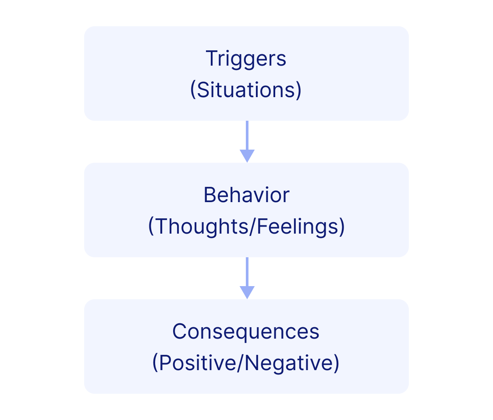

# Lesson - What is a Functional Analysis?

## Screen 1
In this section of the program, we are going to focus on what is called a *functional analysis* of your drug habit. This is the first step in developing control over "out-of-control" behavior. Your drug use is triggered by certain events, situations, and feelings, and maintained by short- and long-term consequences. Therefore, it is important to begin by analyzing your pattern of drug use. Once you have learned to analyze your use, you will learn to rearrange the environment (triggers and consequences) so that you can achieve total abstinence. And finally, you will learn positive alternatives to using drugs. When you have completed these first three steps, you will have taken a large step toward beating your drug addiction.

## Screen 2
In completing a functional analysis of your drug use, it is important to remember the following:

- Individuals with similar substance abuse problems have learned to stop using.

- Drug use is a learned habit or set of behaviors. It does not matter how the problem got started and it does not help to blame anything or anybody for the problem. What does matter is that the user alone is responsible for stopping.

- It is the goal of this treatment program that the user be totally abstinent, or free, from drugs and alcohol. To get the most out of treatment, this goal should be achieved fairly early in the program. But even if a slip (use of drugs) occurs along the way, remember: One instance of using does not mean failure. Many people have occasional slips, but if a slip occurs, it can be used a tool in learning how to achieve total abstinence. The user should immediately leave the situation in which he or she is using and then analyze the chain of events that led up to the use. Understanding this chain will help you to deal with similar situations in the future.

- For us to help you the most, it will be important that you complete your homework assignments and to practice between sessions. Learning and practicing new skills or behaviors is necessary; simply talking about making changes is not enough.

## Screen 3
A functional analysis allows you to identify the causes of your behavior, including your drug-taking behavior. You have probably noticed that in certain situations you use drugs, while in other situations you do not. The situation around us can powerfully control drug use, particularly if we are unaware of its influence.

## Screen 4
Some of the situations that can influence drug use are the following:

a) the people you are with
b) the place you happen to be
c) the time and day
d) how much money you have
e) how much alcohol you have consumed
f) what you are doing besides doing drugs
g) how you are feeling

## Screen 5
The first steps in understanding your drug use (or any regularly occurring behavior like brushing your teeth, golfing) is to *identify* the types of situations which make it likely that you will use drugs.

## Screen 6
Along with identifying these events that occur before you use drugs, you also need to identify the consequences of your use. The two main types of consequences are (1) immediate (and often positive) consequences (for example, the "buzz" or "high") and (2) delayed (often negative) consequences (for example, you blow all the money you had in your pocket and can't pay a bill or you have an unwanted sexual encounter).

## Screen 7
Once you have functionally analyzed your drug use (in other words, identified the triggers and two types of consequences), you can begin to control your drug use.  You will discover certain patterns of your use.  An easy way to see these patterns is to use the following diagram:

## Screen 8
The second step will be to learn to *rearrange the environment* (that is, the situations or "triggers" and consequences) so that you can achieve total abstinence. The third step will be to *learn positive alternatives* to drug use. When you have completed these first three steps, you will have taken a large step toward beating your substance abuse problem. No longer will your use seem "out-of-control", because you will be well aware of the causes for your cravings and use of drugs. In doing this analysis, you will learn to identify the specific ways that using drugs affects your life, and also how events in your life affect your using.

## Screen 9
There are several components to a functional analysis. First, *Functional Analysis* means to analyze the chain of events that come before and follow drug use. These chains are different for each individual. Each time that using occurs, you will learn how to identify the chain of events using the diagram shown above.

## Screen 10
Next, a *Trigger* is something that usually occurs prior to the using. These triggers increase the likelihood of using. A trigger can be an individual, event, or situation, or any combination of these things. These triggers can be very subtle or very strong. Triggers do not make people use drugs, they just make it very likely that a person will want to. Thoughts and feelings are a product of the trigger. These are the internal reactions to the trigger and can be pleasant or unpleasant. They may be thoughts that your friends won't like you if you don't use, a desire to get even with someone, etc. These thoughts and feelings result in the desire to do something.

## Screen 11
Examples of Triggers include:
*Situations*: your job, argument with friend or family member, withdrawal symptoms, being at a certain friend's house, peer pressure to use, being home alone, parties, etc.

*Thoughts*: I need to deal with this trigger, drugs will help, I can't deal with this, I need to use, I need to get away, I need to forget.

*Feelings*: anxiety, depression, anger, frustration, happiness, loneliness, elation.

## Screen 12
A *Behavior* is what you do in response to the trigger. The behavior you will concentrate on for the moment, while filling out your functional analysis, is drug use.

## Screen 13
*Positive Consequences* of using are the rewarding effects that immediately follow using. They are usually considered to be pleasant. Users have learned to use drugs to forget, to become energized, to get rid of depressed feelings, to reduce pain, to feel good, etc. The user learns to expect these positive consequences from using drugs. Because drugs result in a lot of these short-term-positive consequences, it is a hard habit to break.

## Screen 14
*Negative Consequences* of using are the effects of drugs that reduce the quality of a person's life. They are what brought you into treatment, and they don't usually occur until some-time after the using episode, that is, they are delayed, long-term consequences. Because the negative consequences (physical illness, family problems, legal problems, work problems, friend problems, financial problems, emotional problems) happen too far in the future, the user doesn't learn how much drugs use really hurts them.

## Screen 15
Again, the goal of this section of the program is for you to identify the triggers and consequences of your drug use. It is important that you give much thought and effort to analyzing these patterns.

